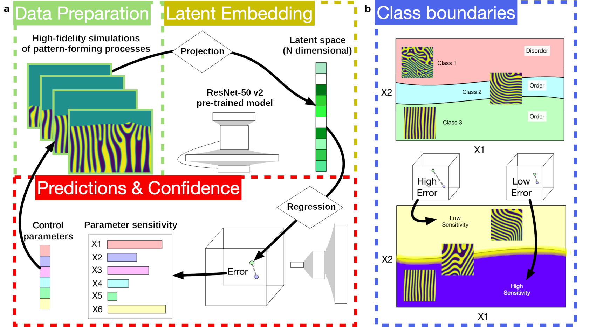
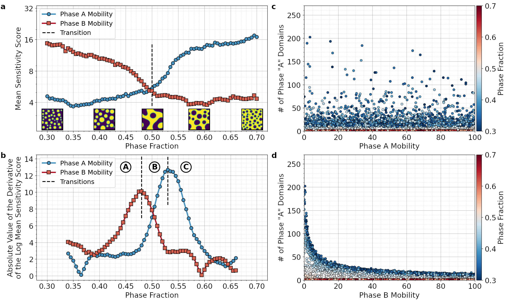
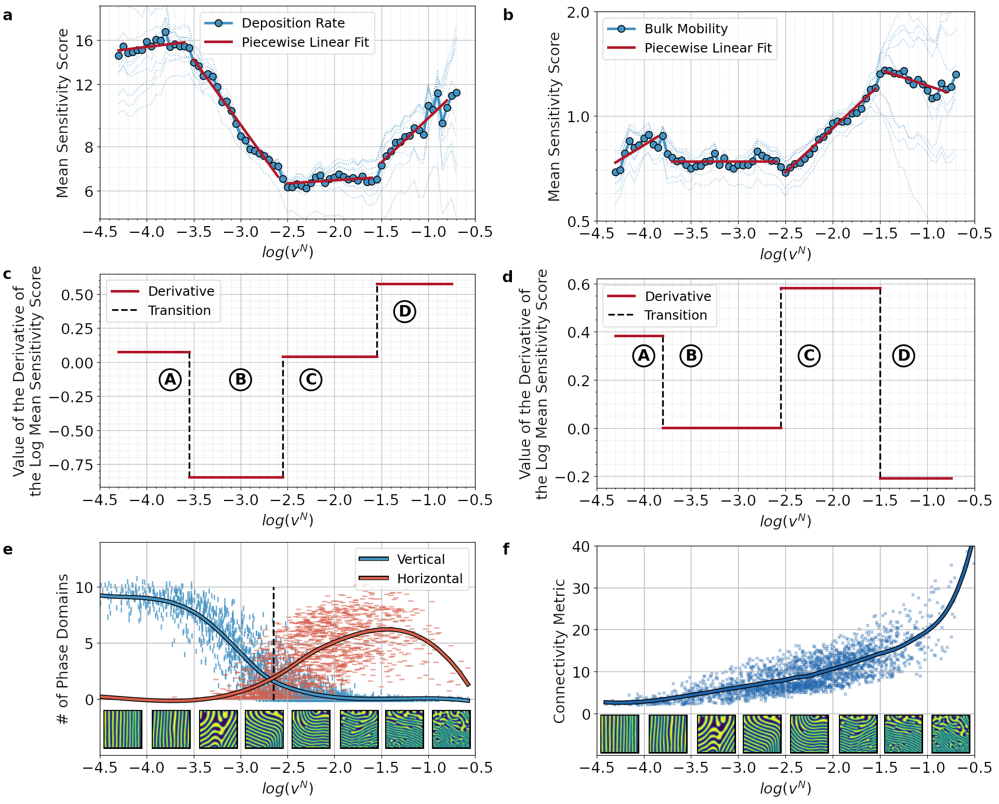

# Topological Transitions

Check our paper: Marcin Abram, Keith Burghardt, Greg Ver Steeg, Aram Galstyan, and Remi Dingreville,
_Inferring topological transitions in pattern-forming processes with self-supervised learning_, _npj_ Computational Materials __8__, 205 (2022), URL [https://www.nature.com/articles/s41524-022-00889-2](https://www.nature.com/articles/s41524-022-00889-2).

## Data Samples

Samples illustrating data used in the study are located in the [data_sample](data_sample) folder.

## Code

Code illustrating our framework is located in the [code](code) folder.

## Framework

Workflow to identify transition regimes in pattern-forming processes via self-supervised learning.



## Key Results

### Spinodal Decomposition of a Two-Phase Mixture

Predicting the process parameters for spinodal deposition of a two-phase mixture.



### Physical Vapor Deposition of Thin Films

Identifying microstructural topological transitions for the physical vapor deposition of thin films.



## Citation

@article{Abram-npj-2022,
  doi = {10.1038/s41524-022-00889-2},
  url = {https://www.nature.com/articles/s41524-022-00889-2},
  year = {2022},
  month = sep,
  publisher = {Springer Science and Business Media {LLC}},
  volume = {8},
  number = {1},
  pages = {205},
  author = {Marcin Abram and Keith Burghardt and Greg Ver Steeg and Aram Galstyan and Remi Dingreville},
  title = {Inferring topological transitions in pattern-forming processes with self-supervised learning},
  journal = {npj Computational Materials}
}
```
