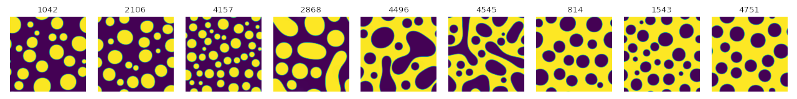
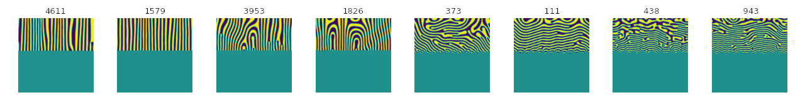

## Data Samples

### Spinodal Decomposition of a Two-Phase Mixture



Data samples describing the spinodal decomposition of a two-phase mixture
are located in the [spinodal_decomposition](spinodal_decomposition) folder.

### Physical Vapor Deposition of Thin Films




Data samples describing the formation of concentration modulations
of binary alloys during physical vapor deposition of thin films
are located in the [physical_vapor_deposition](physical_vapor_deposition) folder.

### Data Loading

All data samples are saved as numpy array. To load the data,
you can use the following code in Python 3.

```python
import numpy
import matplotlib
from matplotlib import pyplot as plt

path = 'data_sample/physical_vapor_deposition/pvd_instance_00111.npy'
data_instance = numpy.load(path)

# Display the instance
plt.imshow(data_instance)
plt.show()
```
